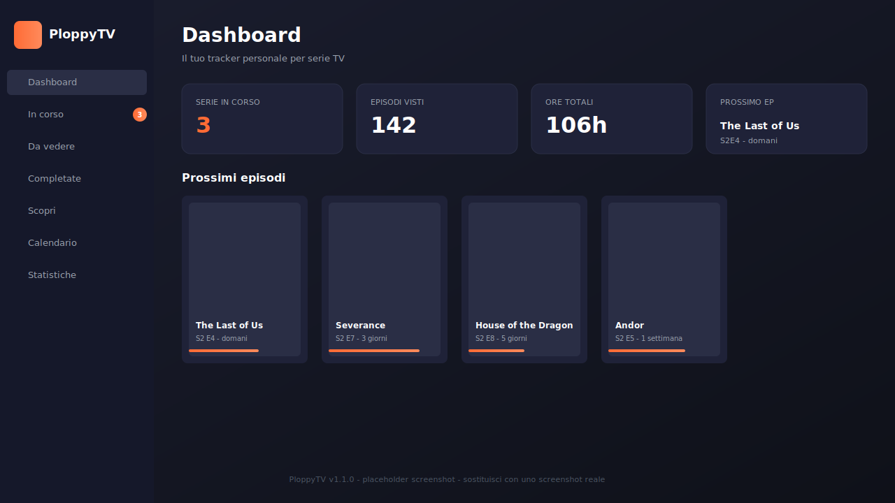

# PloppyTV — Tracker personale per serie TV (PWA)

[](./LICENSE)
[](https://www.typescriptlang.org/)
[](https://vitejs.dev/)
[](https://web.dev/progressive-web-apps/)
[](https://github.com/Cartaz/PloppyTV/actions/workflows/ci.yml)
[](https://github.com/Cartaz/PloppyTV/actions/workflows/deploy.yml)

> Tracker personale per serie TV, in formato PWA local-first. Niente backend, niente account, niente tracking. I tuoi dati restano sul tuo dispositivo; i metadati delle serie arrivano dall'API gratuita di TVMaze.



PloppyTV è una PWA ispirata a TV Time, pensata per tenere traccia delle serie che stai guardando, degli episodi visti, del calendario delle uscite e delle statistiche di visione. Si installa in un click su desktop e mobile, funziona offline, e si aggiorna automaticamente in background tramite Service Worker.

## Indice

- [Funzionalità](#funzionalità)
- [Stack tecnico](#stack-tecnico)
- [Roadmap](#roadmap)
- [Struttura del progetto](#struttura-del-progetto)
- [Sviluppo](#sviluppo)
- [Build di produzione](#build-di-produzione)
- [Deploy su GitHub Pages](#deploy-su-github-pages)
- [Test e qualità del codice](#test-e-qualità-del-codice)
- [Ottimizzazioni implementate](#ottimizzazioni-implementate)
- [Affidabilità: fix da stress test](#affidabilità-fix-da-stress-test)
- [Migrare dati dalla versione originale](#migrare-dati-dalla-versione-originale)
- [Privacy](#privacy)
- [Contribuire](#contribuire)
- [Licenza](#licenza)

## Funzionalità

- **Dashboard** con panoramica rapida delle serie in corso e dei prossimi episodi
- **Liste per stato**: in visione, da guardare, completate
- **Dettaglio serie** con episodi raggruppati per stagione, avanzamento visione e toggle episodio per episodio
- **Scopri**: serie popolari e recenti raggruppate per genere, con preload in background
- **Calendario settimanale** con airdate reali (calcolato in un Web Worker dedicato)
- **Statistiche personali** di visione: episodi visti, ore totali, top generi, top serie
- **Ricerca integrata** su TVMaze con fallback su parole simili
- **Backup/Import** dei dati in formato JSON (manual o multi-device)
- **Funzionamento offline** garantito dal Service Worker (Workbox)
- **Installabile** su desktop e mobile come vera app (PWA), zero fee Apple/Google

## Stack tecnico

- **Vite 5** — bundler + dev server
- **TypeScript 5** in modalità strict — type safety, zero runtime overhead
- **Vanilla JS** (no React/Vue) — logica applicativa leggera, preservata dall'originale
- **vite-plugin-pwa** — Service Worker con Workbox (precache + runtime caching separato per API e immagini)
- **Web Worker** — calcolo di statistiche e calendario off-main-thread (la UI non si blocca su liste grandi)
- **Code-splitting per vista** — Discover, Calendar, Stats, ShowDetail sono chunk separati lazy-loadati
- **Vitest** — suite di test con coverage sui moduli critici (`normalize.ts`, `utils.ts`, `store.ts`)
- **ESLint + Prettier + Husky** — lint e formattazione automatici con pre-commit hook

## Roadmap

PloppyTV segue una roadmap hobby in 5 fasi (P1 → P5) su ~12 mesi, con un focus esplicito su "local-first, no backend, no account, no monetizzazione". Lo scenario completo è in [`docs/roadmap.html`](./docs/roadmap.html) (apribile nel browser per la versione interattiva).

| Fase | Stato | Tema | Tempistica |
| --- | --- | --- | --- |
| **P1** | ✅ Completata in v1.1 | Fondamenta & igiene del progetto | Settimana 1-2 |
| **P2** | 🚧 Prossima | Quality of life quotidiana | Mese 1-3 |
| **P3** | ⏳ Pianificata | Sync multi-device senza backend | Mese 4-6 |
| **P4** | ⏳ Pianificata | AI e discovery intelligente | Mese 7-9 |
| **P5** | ⏳ Opzionale | Bonus e nice-to-have | Mese 10-12 |

**P1 — Fondamenta & igiene del progetto (v1.1.0)**

Tutti i 7 item completati:

- [x] **LICENSE MIT** — file `LICENSE` standard MIT
- [x] **Privacy policy formale** — `PRIVACY.md` con TL;DR, sezioni GDPR, contatti
- [x] **ESLint + Prettier** — config minimale + Husky pre-commit hook con `lint-staged`
- [x] **Vitest + 64 test core** — coverage 31% su `normalize.ts`, `utils.ts`, `store.ts` (soglia minima 30%)
- [x] **CONTRIBUTING.md** — setup, struttura, convenzioni commit, workflow PR
- [x] **README arricchito** — badge, screenshot placeholder, sezioni test/privacy/roadmap
- [x] **GitHub Release v1.1.0** — changelog e release notes

**Stop condition:** la regola d'oro della roadmap è "se una fase ti stressa, salta alla successiva". P1 è il prerequisito per condividere l'app con conoscenti in buona fede; da P2 in poi è tutto bonus.

## Struttura del progetto

```
ploppytv/
├── index.html                 # HTML entry (carica /src/main.ts)
├── vite.config.ts             # Config Vite + PWA
├── vitest.config.ts           # Config Vitest (jsdom, coverage v8)
├── tsconfig.json
├── package.json
├── LICENSE                    # Licenza MIT
├── PRIVACY.md                 # Privacy policy formale
├── CONTRIBUTING.md            # Guida per contributor
├── .eslintrc.cjs              # Config ESLint
├── .prettierrc.json           # Config Prettier
├── .lintstagedrc.cjs          # Config lint-staged (usato da Husky pre-commit)
├── .husky/pre-commit          # Git hook pre-commit
├── .github/
│   ├── workflows/
│   │   ├── ci.yml             # type-check + lint + test + build su PR
│   │   └── deploy.yml         # build + deploy su GitHub Pages
│   ├── ISSUE_TEMPLATE/        # Bug report + Feature request templates
│   └── PULL_REQUEST_TEMPLATE.md
├── screenshots/               # Screenshot ufficiali per README
├── public/
│   ├── favicon.ico
│   └── icons/                 # icone PWA (192, 512, maskable, ...)
├── scripts/
│   └── test-entry.ts          # Re-export delle funzioni interne per stress-test manuali
├── tests/                     # Suite Vitest
│   ├── helpers.ts             # Factory per Show/Episode
│   ├── utils.test.ts          # Test su safeId, safeNum, stripHtml, date, escape
│   ├── watched.test.ts        # Test su getWatchedCount, findNextEpisode
│   ├── normalize.test.ts      # Test su normalizeShow, buildShowFromTvmaze, reconcileAllLists
│   └── store.test.ts          # Test su reconcileList, updateShowListStatus, manualList
└── src/
    ├── main.ts                # Entry point: init moduli + register SW
    ├── types.ts               # Tipi condivisi UI ↔ worker
    ├── vite-env.d.ts
    ├── styles/
    │   └── main.css           # Tutto il CSS (estratto dall'originale)
    ├── lib/
    │   ├── constants.ts       # API_BASE, chiavi storage, config discover
    │   ├── utils.ts           # Helper puri (date, escape, watched count)
    │   ├── store.ts           # State store con subscribe + mutators
    │   ├── storage.ts         # localStorage + backup + multi-tab sync
    │   ├── api.ts             # Client TVMaze con timeout/abort
    │   ├── normalize.ts       # Validazione + sanitizzazione show
    │   ├── shows.ts           # Azioni: add/remove/move/toggle episode
    │   └── discover.ts        # Fetch serie popolari + grouping per genere
    ├── worker/
    │   ├── stats.worker.ts    # Worker: computeStats + computeCalendar
    │   └── client.ts          # Wrapper con fallback main-thread
    ├── components/
    │   ├── toast.ts           # Toast notifications
    │   ├── modal.ts           # Modal dialog con stack e focus trap
    │   ├── header.ts          # Nav, sidebar mobile, badges, about modal
    │   ├── search.ts          # Search box TVMaze
    │   ├── exportImport.ts    # Backup JSON
    │   ├── img.ts             # imgTag() con data-fallback
    │   ├── imageFallback.ts   # Delegato globale fallback immagini
    │   └── renderer.ts        # Router viste con code-splitting
    ├── views/
    │   ├── dashboard.ts
    │   ├── showList.ts        # watching / towatch / completed
    │   ├── showDetail.ts
    │   ├── discover.ts
    │   ├── calendar.ts        # usa worker
    │   └── stats.ts           # usa worker
    └── sw.ts                  # Service Worker (Workbox injectManifest)
```

## Sviluppo

```bash
npm install
npm run dev          # http://localhost:5173
```

Il primo `npm install` attiva anche `husky` (tramite lo script `prepare`) che installa i git hook pre-commit. Per verificare che il hook sia attivo: `cat .husky/pre-commit` — dovrebbe eseguire `npx lint-staged`.

## Build di produzione

```bash
npm run build        # output in dist/
npm run preview      # serve dist/ su http://localhost:4173
```

## Deploy su GitHub Pages

Il workflow `.github/workflows/deploy.yml` è preconfigurato. Per deployare:

1. Crea un repo su GitHub e pusha il progetto
2. Vai in **Settings → Pages → Build and deployment → Source**: seleziona **GitHub Actions**
3. Al prossimo push su `main`, il workflow builda e pubblica automaticamente
4. L'URL sarà `https://<username>.github.io/<repo-name>/`

Il base path è configurato automaticamente dal workflow:

- Se il repo si chiama `<user>.github.io` → base `/`
- Altrimenti → base `/<repo-name>/`

Per deploy custom (es. dominio proprio), puoi sovrascrivere con variabile d'ambiente:

```bash
VITE_BASE_PATH=/mio-percorso/ npm run build
```

## Test e qualità del codice

P1 ha introdotto una suite di test e tooling di qualità. Tutti gli script sono in `package.json`:

| Script | Scopo |
| --- | --- |
| `npm run typecheck` | Solo `tsc --noEmit`, veloce |
| `npm run lint` | ESLint con `--max-warnings=0` |
| `npm run lint:fix` | ESLint con auto-fix |
| `npm run format` | Prettier su tutti i sorgenti |
| `npm run format:check` | Prettier in modalità check (usato in CI) |
| `npm run test` | Vitest run unico |
| `npm run test:watch` | Vitest in watch mode durante lo sviluppo |
| `npm run test:coverage` | Vitest + coverage report (soglia minima 30%) |

I 64 test coprono i moduli critici di `src/lib/`:

- `utils.ts` (26 test): `safeId`, `safeNum`, `safeImageUrl`, `stripHtml`, `parseISODateLocal`, `escapeHtml`, `getPosterUrl`
- `normalize.ts` (18 test): `normalizeShow`, `buildShowFromTvmaze`, `reconcileAllLists`
- `store.ts` (11 test): `reconcileList`, `updateShowListStatus` con rispetto di `manualList`
- `watched.ts` (9 test): `getWatchedCount`, `findNextEpisode` con ordinamento stagioni/episodi

Il pre-commit hook (`.husky/pre-commit` → `lint-staged`) esegue ESLint e Prettier solo sui file modificati prima di ogni commit, bloccando il commit se ci sono errori. La CI (`.github/workflows/ci.yml`) esegue typecheck, lint, format check e test su ogni PR e push su `main`.

## Ottimizzazioni implementate rispetto all'originale

| Ottimizzazione                | Effetto                                                                |
| ----------------------------- | ---------------------------------------------------------------------- |
| Code-splitting viste          | Carico iniziale -26% gzip (26.8KB → 19.8KB)                            |
| Web Worker per stats/calendar | UI non si blocca su liste grandi                                       |
| vite-plugin-pwa (Workbox)     | SW robusto con expiration plugin, cache separata per API/img           |
| Event delegation globale      | Un solo handler click sul main invece di centinaia di `onclick` inline |
| Image fallback delegato       | Un handler `error` capture-phase invece di `onerror` per ogni img      |
| TypeScript strict             | Type safety senza runtime overhead                                     |
| `preconnect` a TVMaze         | -100-300ms TTI su prima visita                                         |
| `loading="lazy"` ovunque      | Risparmio banda iniziale                                               |

## Affidabilità: fix da stress test

L'ultimo giro di sviluppo si è concentrato sulla robustezza dell'app in scenari reali (più tab aperte, worker che risponde in ritardo, SW che aggiorna in background, uso da tastiera/screen reader). In sintesi:

| Area                            | Problema risolto                                                                                                                                                                                                            |
| ------------------------------- | --------------------------------------------------------------------------------------------------------------------------------------------------------------------------------------------------------------------------- |
| **Storage multi-tab**           | Scritture concorrenti tra tab diverse ora usano un controllo ottimistico (CAS su `savedAt`): se un'altra tab ha già salvato, la scrittura corrente viene rifiutata invece di sovrascrivere silenziosamente i dati           |
| **Modali nidificate**           | `modal.ts` ora gestisce uno **stack** di modali: aprire una modale da dentro un'altra non chiude più anche quella padre; aggiunti focus trap, `role="dialog"`, `aria-modal` e gestione ESC                                  |
| **Web Worker (stats/calendar)** | Le richieste al worker portano un `id` di correlazione: risposte in ritardo da richieste precedenti non vengono più confuse con quella corrente; aggiunto `worker.onerror` per catturare errori di caricamento dello script |
| **Aggiornamento PWA**           | Un nuovo Service Worker "in attesa" ora mostra un toast che permette di applicare subito l'update, invece di restare bloccato finché l'utente non chiude manualmente tutte le tab                                           |
| **Routing con hash**            | Gli shortcut PWA (`#dashboard`, `#discover`, `#calendar`) e i deep link a una serie (`#show/<id>`) ora vengono interpretati anche dopo il caricamento iniziale e supportano avanti/indietro del browser                     |
| **Ricerca TVMaze**              | Corretta una race condition per cui i risultati di una ricerca precedente potevano sovrascrivere quelli di una più recente                                                                                                  |
| **Normalizzazione dati**        | Sanitizzazione più rigorosa dei dati importati/da API (percentuali di progresso e conteggi episodi ora sempre in un range valido, niente più `NaN`/negativi)                                                                |

## Migrare dati dalla versione originale

La struttura dati `ploppytv_data_v1` in localStorage è **identica e compatibile**. Se avevi già la PWA originale installata e funzionante, i dati vengono automaticamente riconosciuti dalla nuova versione.

Per sicurezza: usa "Esporta" nella vecchia versione per creare un backup JSON, poi "Importa" nella nuova.

## Privacy

PloppyTV è **local-first by design**:

- Tutti i dati restano nel `localStorage` del tuo browser
- Nessun backend, nessun account, nessun server di terze parti
- Le uniche chiamate di rete sono verso l'API pubblica di TVMaze per i metadati delle serie
- Nessun tracking, nessun analytics, nessun cookie di terze parti

La privacy policy completa è in [`PRIVACY.md`](./PRIVACY.md). È linkata anche dal modal "Informazioni" dentro l'app.

## Contribuire

Le PR sono benvenute. Leggi [`CONTRIBUTING.md`](./CONTRIBUTING.md) per:

- Setup dell'ambiente di sviluppo
- Convenzioni di codice (TypeScript strict, Prettier, ESLint, Conventional Commits)
- Workflow di una PR (typecheck → lint → test → build → push)
- Come aprire bug report e feature request (template in `.github/ISSUE_TEMPLATE/`)

## Licenza

[MIT](./LICENSE) — © 2026 Cartaz. Il codice è pubblico, audit-able, fork-able. Le informazioni sulle serie TV sono fornite dall'API pubblica gratuita di [TVMaze](https://www.tvmaze.com).
