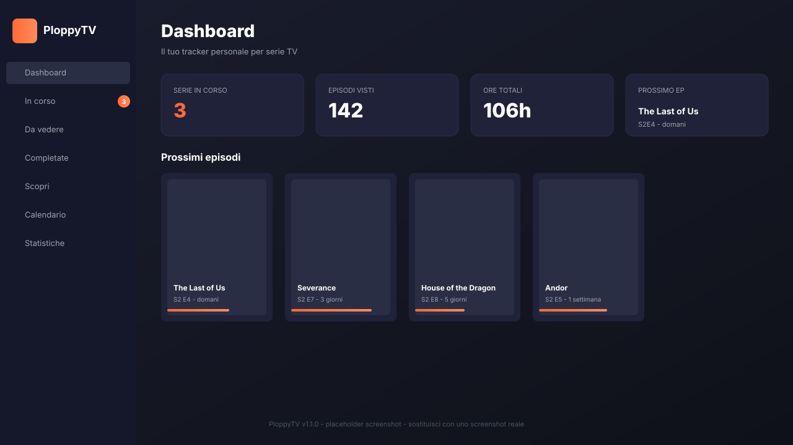

# PloppyTV — Tracker personale per serie TV (PWA)

[](./LICENSE)
[](https://www.typescriptlang.org/)
[](https://vitejs.dev/)
[](https://web.dev/progressive-web-apps/)
[](https://github.com/Cartaz/PloppyTV/actions/workflows/ci.yml)
[](https://github.com/Cartaz/PloppyTV/actions/workflows/deploy.yml)

> Tracker personale per serie TV, in formato PWA local-first. Niente backend, niente account, niente tracking. I tuoi dati restano sul tuo dispositivo; i metadati delle serie arrivano dall'API gratuita di TVMaze.



PloppyTV è una PWA ispirata a TV Time, pensata per tenere traccia delle serie che stai guardando, degli episodi visti, del calendario delle uscite e delle statistiche di visione. Si installa su desktop e mobile, funziona offline e gestisce gli aggiornamenti tramite Service Worker.

## Indice

- [Funzionalità](#funzionalità)
- [Stack tecnico](#stack-tecnico)
- [Roadmap](#roadmap)
- [Struttura del progetto](#struttura-del-progetto)
- [Sviluppo](#sviluppo)
- [Build di produzione](#build-di-produzione)
- [Deploy su GitHub Pages](#deploy-su-github-pages)
- [Test e qualità del codice](#test-e-qualità-del-codice)
- [Ottimizzazioni implementate](#ottimizzazioni-implementate)
- [Affidabilità](#affidabilità)
- [Migrare dati da versioni precedenti](#migrare-dati-da-versioni-precedenti)
- [Privacy](#privacy)
- [Contribuire](#contribuire)
- [Licenza](#licenza)

## Funzionalità

- **Dashboard** con panoramica rapida delle serie in corso e dei prossimi episodi
- **Liste per stato**: in visione, da guardare, completate
- **Dettaglio serie** con episodi raggruppati per stagione, avanzamento visione e toggle episodio per episodio
- **Rating 5★ per episodio** con media stagione
- **Note private per episodio** con editor modale
- **Tag personalizzabili per serie** con filtro nelle liste
- **Scopri**: serie popolari e recenti raggruppate per genere, caricate on demand con cache locale
- **Libreria** con ricerca avanzata e filtri
- **Rivedi un episodio casuale** tra gli episodi valutati 5★
- **Calendario settimanale** con airdate reali
- **Statistiche personali** di visione
- **Year-in-Review** con export PNG
- **Keyboard shortcuts** per ricerca, navigazione ed episodi
- **i18n IT + EN** con persistenza della lingua
- **Notifiche locali best-effort** per i nuovi episodi, senza backend o Push server
- **Ricerca integrata** su TVMaze
- **Backup/Import** dei dati in formato JSON
- **Funzionamento offline** tramite Service Worker
- **Installabile** come PWA su desktop e mobile

## Stack tecnico

- **Vite 6** — bundler + dev server
- **TypeScript 5** in modalità strict
- **Vanilla TypeScript/DOM** — nessun framework UI
- **vite-plugin-pwa + Workbox** — precache e runtime caching
- **Web Worker** — statistiche e calendario off-main-thread con fallback main-thread
- **Code-splitting per vista** — le viste più pesanti vengono caricate solo quando servono
- **Vitest + jsdom + V8 coverage** — test dei contratti e coverage sull'intero runtime TypeScript
- **ESLint + Prettier + Husky** — lint e formattazione automatizzati

## Roadmap

PloppyTV segue una roadmap hobby in 5 fasi (P1 → P5), con un focus esplicito su "local-first, no backend, no account, no monetizzazione". Il documento canonico è [`docs/roadmap.html`](./docs/roadmap.html).

| Fase | Stato | Tema | Tempistica |
| --- | --- | --- | --- |
| **P1** | ✅ Completata in v1.1 | Fondamenta & igiene del progetto | Settimana 1-2 |
| **P2** | ✅ Completata | Quality of life quotidiana | Mese 1-3 |
| **P3** | ⏳ Pianificata | Sync multi-device senza backend | Mese 4-6 |
| **P4** | ⏳ Pianificata | AI e discovery intelligente | Mese 7-9 |
| **P5** | ⏳ Opzionale | Bonus e nice-to-have | Mese 10-12 |

**P1 — Fondamenta & igiene del progetto (v1.1.0)**

- [x] LICENSE MIT
- [x] Privacy policy formale
- [x] ESLint + Prettier + Husky
- [x] Vitest con coverage gate sul runtime
- [x] CONTRIBUTING.md
- [x] README e documentazione di progetto
- [x] Release v1.1.0

**P2 — Quality of life quotidiana**

- [x] Rating episodio
- [x] Note episodio
- [x] Tag serie
- [x] Libreria con filtri avanzati
- [x] Episodio 5★ casuale
- [x] Keyboard shortcuts
- [x] i18n IT + EN
- [x] Year-in-Review
- [x] Notifiche locali

Da P3 in poi le funzionalità restano opzionali e devono rispettare il carattere local-first dell'app.

## Struttura del progetto

La struttura è descritta per responsabilità, non come elenco esaustivo di file:

```text
ploppytv/
├── src/
│   ├── lib/          # dominio, stato, persistenza, API, normalizzazione, i18n
│   ├── components/   # componenti DOM e boundary UI
│   ├── views/        # viste applicative
│   ├── worker/       # compute puro, worker e client/fallback
│   ├── locales/      # dizionari di traduzione
│   ├── styles/       # stile globale
│   ├── main.ts       # bootstrap dell'app
│   └── sw.ts         # Service Worker
├── tests/            # test di contratto, regressione e integrazione jsdom
├── docs/             # roadmap e release notes
├── public/           # icone e asset statici PWA
├── .github/workflows # CI e deploy GitHub Pages
├── index.html
├── vite.config.ts
└── vitest.config.ts
```

Le decisioni di validazione dei documenti persistiti sono centralizzate in `src/lib/dataDocument.ts`; worker e fallback condividono il compute puro in `src/worker/compute.ts`.

## Sviluppo

```bash
npm install
npm run dev
```

Il primo `npm install` attiva anche Husky tramite lo script `prepare`. Il pre-commit hook esegue `lint-staged` sui file modificati.

## Build di produzione

```bash
npm run build
npm run preview
```

`npm run build` esegue prima il type-check e poi la build Vite.

## Deploy su GitHub Pages

Il workflow `.github/workflows/deploy.yml` pubblica la build su GitHub Pages a ogni push pertinente su `main`.

Il base path è configurabile tramite `VITE_BASE_PATH`; in assenza di override viene usato il comportamento definito in `vite.config.ts`.

## Test e qualità del codice

Gli script di qualità sono definiti in `package.json`:

| Script | Scopo |
| --- | --- |
| `npm run typecheck` | Type-check TypeScript senza emissione |
| `npm run lint` | ESLint con warning trattati come errore |
| `npm run lint:fix` | ESLint con auto-fix |
| `npm run format` | Formattazione Prettier |
| `npm run format:check` | Verifica Prettier |
| `npm run test` | Suite Vitest |
| `npm run test:watch` | Vitest in watch mode |
| `npm run test:coverage` | Suite completa con V8 coverage |

La suite protegge i contratti osservabili dell'app: normalizzazione e schema dati, persistenza e concorrenza multi-tab, store, API, worker/fallback, rendering e interazioni DOM, import/export, PWA bootstrap, i18n, keyboard e notifiche.

Il coverage viene misurato sull'intero runtime TypeScript. Le soglie di regressione hanno **un'unica fonte di verità** in [`vitest.config.ts`](./vitest.config.ts); il README non ne duplica i valori per evitare drift documentale.

La CI in `.github/workflows/ci.yml` esegue su PR e push:

1. type-check + build;
2. ESLint + Prettier + dependency audit;
3. Vitest + coverage gate.

I test storici di bug hunting vengono mantenuti solo quando proteggono un contratto non già posseduto da una suite più focalizzata.

## Ottimizzazioni implementate

| Ottimizzazione | Effetto |
| --- | --- |
| Code-splitting delle viste | evita di caricare subito viste non richieste |
| Discover on demand | evita fetch e lavoro di discovery prima dell'apertura della vista |
| Web Worker per stats/calendar | sposta il compute pesante fuori dal main thread quando disponibile |
| Compute condiviso worker/fallback | una sola implementazione degli algoritmi |
| Event delegation | riduce listener DOM duplicati |
| Image fallback delegato | centralizza il fallback delle immagini |
| TypeScript strict | rende espliciti molti invarianti a compile time |
| Lazy loading immagini | riduce il lavoro iniziale su liste lunghe |

Le ottimizzazioni prestazionali vengono mantenute solo quando hanno una responsabilità chiara; il README evita percentuali storiche non continuamente misurate.

## Affidabilità

Gli stress test e i successivi audit hanno consolidato soprattutto questi contratti:

| Area | Contratto |
| --- | --- |
| **Storage multi-tab** | controllo ottimistico della revisione prima di sovrascrivere dati persistiti |
| **Schema dati** | validazione e canonicalizzazione centralizzate prima di usare documenti persistiti/importati |
| **Modali** | stack, focus trap, ESC e semantica accessibile |
| **Web Worker** | correlazione delle risposte, timeout, error handling e fallback deterministico |
| **PWA update** | gestione esplicita degli aggiornamenti del Service Worker |
| **Routing** | hash/deep link compatibili con navigazione browser |
| **Ricerca TVMaze** | protezione dalle risposte stale di ricerche precedenti |
| **Rendering** | escaping/sanitizzazione ai boundary appropriati |

## Migrare dati da versioni precedenti

La chiave di storage storica viene mantenuta per compatibilità. I documenti legacy supportati vengono normalizzati al modello corrente attraverso il boundary di canonicalizzazione; versioni future non riconosciute vengono rifiutate invece di essere interpretate in modo permissivo.

Prima di una migrazione o di un aggiornamento importante è comunque consigliato usare **Esporta** per creare un backup JSON.

## Privacy

PloppyTV è **local-first by design**:

- lo stato del tracker resta nel browser; non esiste un backend PloppyTV né un account;
- la versione pubblica è servita da GitHub Pages e i metadati/poster arrivano da TVMaze;
- Discover contatta TVMaze solo quando la vista viene richiesta;
- PloppyTV non aggiunge analytics, tracking o cookie applicativi.

La privacy policy completa è in [`PRIVACY.md`](./PRIVACY.md).

## Contribuire

Leggi [`CONTRIBUTING.md`](./CONTRIBUTING.md) per setup, convenzioni di codice, workflow delle PR e template per bug/feature request.

Una modifica è pronta quando i controlli pertinenti sono verdi e non introduce una seconda strada equivalente per lo stesso comportamento.

## Licenza

[MIT](./LICENSE) — © 2026 Cartaz. Le informazioni sulle serie TV sono fornite dall'API pubblica gratuita di [TVMaze](https://www.tvmaze.com).
